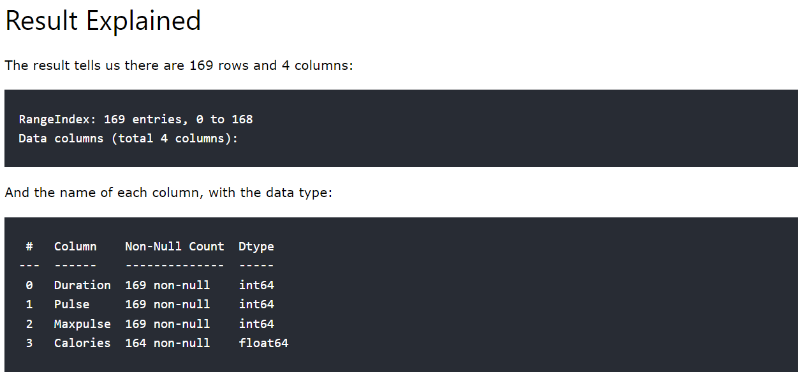
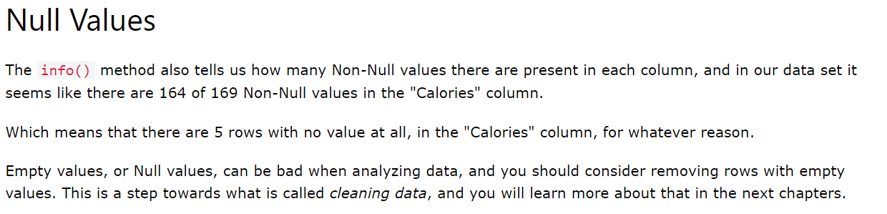

# Pandas - Analysing DataFrames
## Viewing the data
### Head method
- One of the most used method for getting a quick overview of the DataFrame, is the head() method.
- The head() method returns the headers and a specified number of rows, starting from the top.
### Example:
- Program:
```
import pandas as pd
df=pd.read_csv('data.csv')
print(df.head(10))
```
- Output:
```
   Duration  Pulse  Maxpulse  Calories
0        60    110       130     409.1
1        60    117       145     479.0
2        60    103       135     340.0
3        45    109       175     282.4
4        45    117       148     406.0
5        60    102       127     300.5
6        60    110       136     374.0
7        45    104       134     253.3
8        30    109       133     195.1
9        60     98       124     269.0
```
## Note: Note: if the number of rows is not specified, the head() method will return the top 5 rows.
### Example:
- Program:
```
import pandas as pd
df=pd.read_csv('data.csv')
print(df.head()) # it prints the first five rows
```
- Output:
```
   Duration  Pulse  Maxpulse  Calories
0        60    110       130     409.1
1        60    117       145     479.0
2        60    103       135     340.0
3        45    109       175     282.4
4        45    117       148     406.0
```
### Tail method
- There is also a tail() method for viewing the last rows of the DataFrame.
- The tail() method returns the headers and a specified number of rows, starting from the bottom.
### Example:
- Program:
```
import pandas as pd
df=pd.read_csv('data.csv')
print(df.tail())
```
- Output:
```
     Duration  Pulse  Maxpulse  Calories
164        60    105       140     290.8
165        60    110       145     300.4
166        60    115       145     310.2
167        75    120       150     320.4
168        75    125       150     330.4
```
### Example:
- Program:
```
import pandas as pd
df = pd.read_csv('data.csv')
print(df.tail(10))
```
- Output:
```
     Duration  Pulse  Maxpulse  Calories
159        30     80       120     240.9
160        30     85       120     250.4
161        45     90       130     260.4
162        45     95       130     270.0
163        45    100       140     280.9
164        60    105       140     290.8
165        60    110       145     300.4
166        60    115       145     310.2
167        75    120       150     320.4
168        75    125       150     330.4
```
## Info about the data
- The DataFrames object has a method called ```info()```, that gives you more information about the data set.
### Example:
- Program:
```
import pandas as pd
df=pd.read_csv('data.csv')
print(df.info())
```
- Output:
```
<class 'pandas.core.frame.DataFrame'>
RangeIndex: 169 entries, 0 to 168
Data columns (total 4 columns):
 #   Column    Non-Null Count  Dtype  
---  ------    --------------  -----  
 0   Duration  169 non-null    int64  
 1   Pulse     169 non-null    int64  
 2   Maxpulse  169 non-null    int64  
 3   Calories  164 non-null    float64
dtypes: float64(1), int64(3)
memory usage: 5.4 KB
None
```

