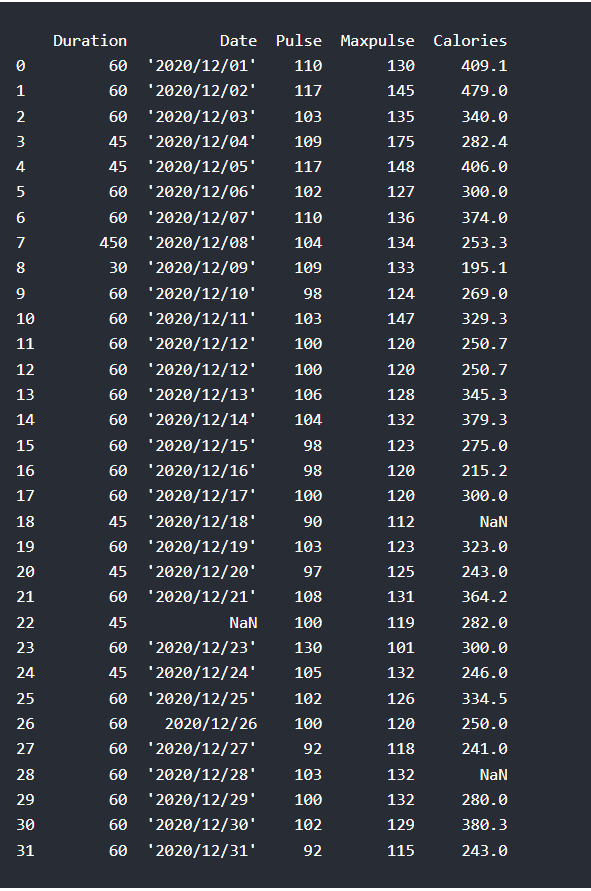
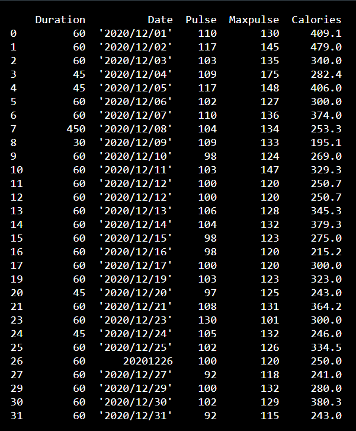
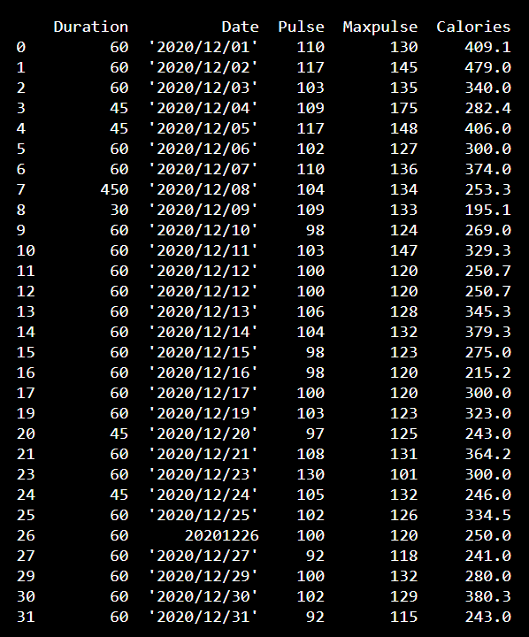
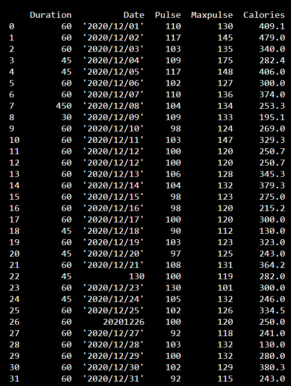
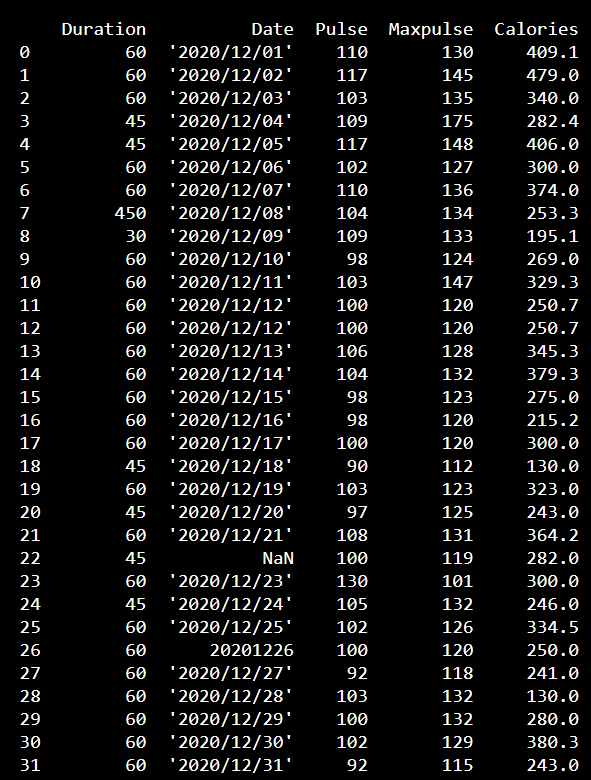
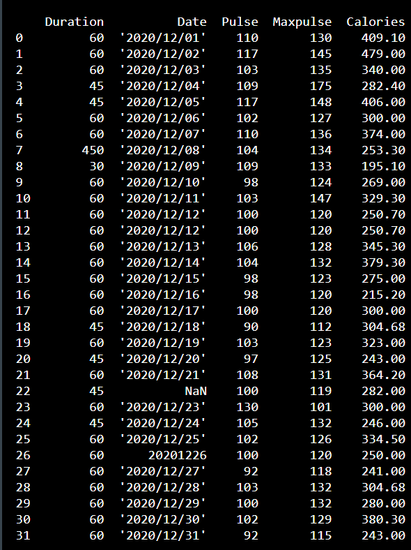
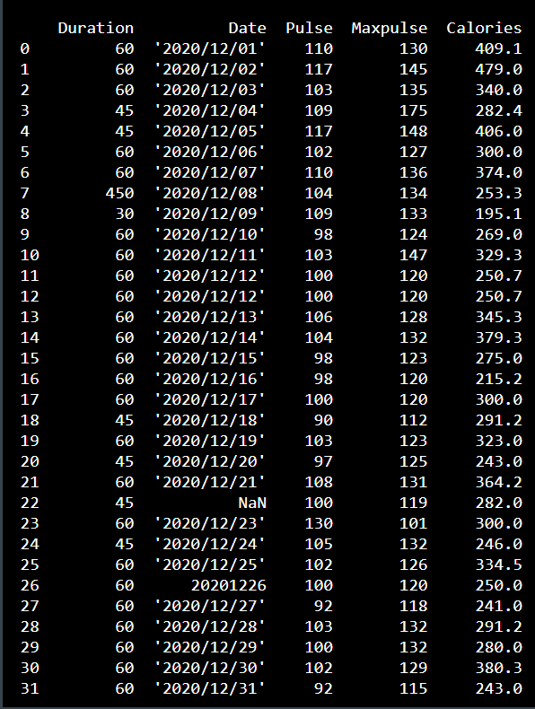
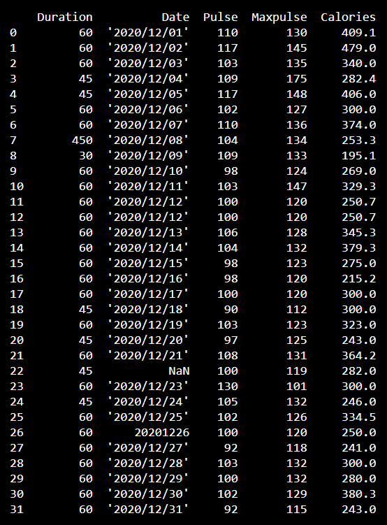

# Pandas - Cleaning Data
## Data Cleaning
- Data cleaning means fixing bad data in your data set.
- Bad data could be:
    - Empty cells
    - Data in wrong format
    - Wrong data
    - Duplicates
### Our Data Set
- We will use this data set:

-  The data set contains some empty cells ("Date" in row 22, and "Calories" in row 18 and 28).
- The data set contains wrong format ("Date" in row 26).
- The data set contains wrong data ("Duration" in row 7).
- The data set contains duplicates (row 11 and 12).
## Cleaning empty cells
### Empty cells
- Empty cells can potentially give you a wrong result when you analyze data.
### Remove Rows
- One way to deal with empty cells is to remove rows that contain empty cells.
- This is usually OK, since data sets can be very big, and removing a few rows will not have a big impact on the result.
- The ```dropna()``` method removes the rows that contains NULL values.
### Example:
- Program:
```
import pandas as pd
df=pd.read_csv('data.csv')
new_df=df.dropna()
print(new_df.to_string())
#Notice in the result that some rows have been removed (row 18, 22 and 28).
#These rows had cells with empty values.
```
- Output:

### Note: By default, the dropna() method returns a new DataFrame, and will not change the original.
- If you want to change the original DataFrame, use the ```inplace = True``` argument:
### Example:
- Program:
```
import pandas as pd
df=pd.read_csv('data.csv')
df.dropna(inplace=True)
print(df)
```
- Output:

### Note: Now, the dropna(inplace = True) will NOT return a new DataFrame, but it will remove all rows containing NULL values from the original DataFrame.
## Replace empty values
- Another way of dealing with empty cells is to insert a new value instead.
- This way you do not have to delete entire rows just because of some empty cells.
- The ```fillna()``` method allows us to replace empty cells with a value:
### Example:
- Program:
```
import pandas as pd
df=pd.read_csv('data.csv')
df.fillna(130,inplace=True) # replaces the same value for all empty values
print(df)
```
- Output:

- The example above replaces all empty cells in the whole Data Frame.
### Replace Only For Specified Columns
- To only replace empty values for one column, specify the column name for the DataFrame
### Example:
- Program:
```
import pandas as pd
df=pd.read_csv('data.csv')
df['Calories'].fillna(130,inplace=True)
print(df.to_string()) # in this tO_string is not required because the rows are lesser than pd.options.display.max_rows()
#This operation inserts 130 in empty cells in the "Calories" column (row 18 and 28).
```
- Output:

## Replace Using Mean, Median, or Mode
- A common way to replace empty cells, is to calculate the mean, median or mode value of the column.
- Pandas uses the mean() median() and mode() methods to calculate the respective values for a specified column
### Using mean
#### Example:
- Program:
```
import pandas as pd
df=pd.read_csv('data.csv')
mean=df['Calories'].mean()
df['Calories'].fillna(mean,inplace=True)
print(df.to_string())
#As you can see in row 18 and 28, the empty values from "Calories" was replaced with the mean: 304.68
```
- Output:

#### Note: Mean = the average value (the sum of all values divided by number of values).
### Using median
#### Example:
- Program:
```
import pandas as pd
df=pd.read_csv('data.csv')
median=df['Calories'].median()
df['Calories'].fillna(median,inplace=True)
print(df)
#As you can see in row 18 and 28, the empty values from "Calories" was replaced with the median: 291.2
```
- Output:

#### Note: Median = the value in the middle, after you have sorted all values ascending.
### Using Mode
#### Example:
- Program:
```
import pandas as pd
df=pd.read_csv('data.csv')
mode=df['Calories'].mode()[0] # take note of the [0] after mode()
df['Calories'].fillna(mode,inplace=True)
print(df)
#As you can see in row 18 and 28, the empty value from "Calories" was replaced with the mode: 300.0
```
- Output:

#### Note: Mode = the value that appears most frequently.